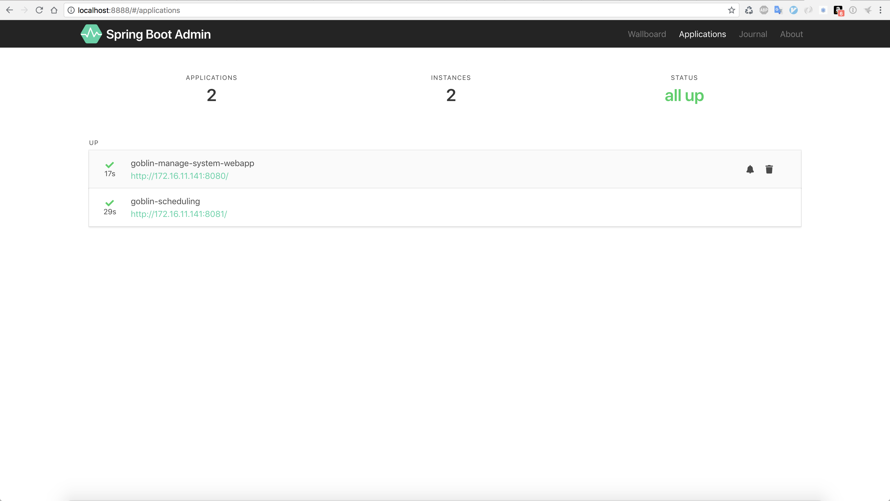
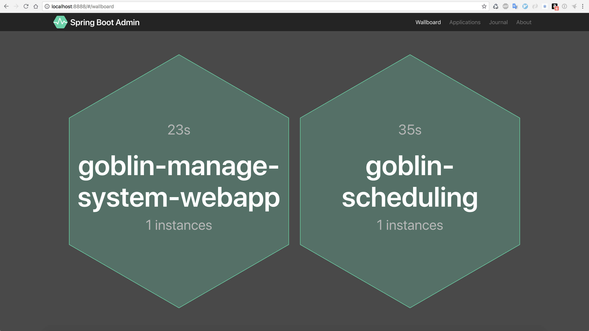
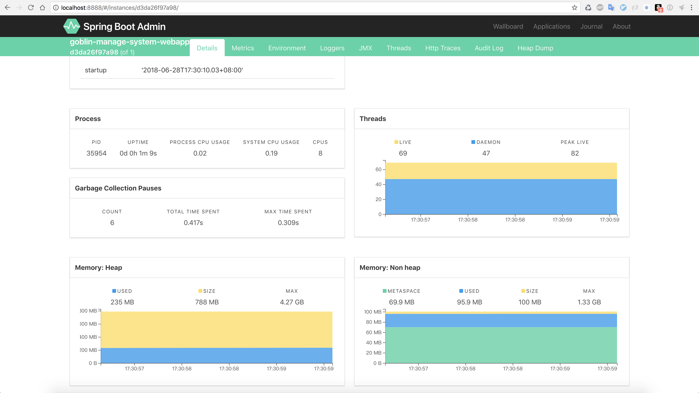

# Spring Boot 基础骨架

+ 升级到 spring boot 2.0






项目可以打成jar部署,也可以打成war部署,默认使用jar

``` xml
<groupId>com.goblin</groupId>
    <artifactId>goblin-restful-client</artifactId>
    <!--<packaging>war</packaging>-->
<packaging>jar</packaging>
```

也可以用Docker部署,要求
 + 本地含有Docker,启动状态
 + Docker包含JDK1.8,如没有安装即可
 ``` shell
 docker pull java
 ```
 
maven打包命令 : mvn clean package docker:build


项目所用技术
 + Spring 
 + Spring Boot
 + Spring MVC
 + Spring Session(已不使用,项目无状态)
 + Spring Security
 + Spring Cache
 + Spring Boot Admin
 + Hibernate Validator
 + Mybatis Plus 
 + Redis 
 + Swagger(已废弃)
 + Pagehelper
 + Druid
 + Log4j2
 + WebSocket
 + JWT(JSON Web Tokens)
 + WebSocket
 + jasypt 配置文件加密

项目包含了
 + 分布式锁
 + 分布式唯一code构建
 + 分布式session共享(已不使用,项目无状态)
 + 异步处理
 + Aop缓存
 + 基础CRUD
 + 物理分页
 + 异步日志,多线程下用户的会话跟踪
 + Swagger restful api
 + 异常统一处理
 + Cors解决跨域
 + 注入攻击拦截器
 + 多环境配置
 + 基本工具类
 + jwt认证
 + Spring Security基础权限管理
 + 细粒度权限控制(粒度控制到字段)
 + 验证码
 + Spring Boot Admin 管理和监视
 + 极简分布式任务调度
 + WebSocket 简单示例
 
 
要求 : 
 + JDK 1.8
 + redis 默认使用 127.0.0.1:6379
 + mysql root/12345678 127.0.0.1:3306 数据库名称 : goblin,基础sql见init.sql
 + lombok 插件(eclipse IntelliJ IDEA),不然项目可能会报错,但是不影响运行


## 权限
Spring Security在这里仅仅只是用来认证(登录认证).

细粒度的权限是自行实现,resources/manage_system.pdm可以自行查看 manage_permission_resource, manage_role, manage_role_permission_resource, manage_user, manage_user_role
代码中 AdminPermissionInterceptor 进行拦截控制,具体看代码实现,都有注释.

这里没有后台页面,权限的管理需要自行设计页面处理,或者自己插入脚本.

## 项目无状态

不使用session

``` java
com.goblin.ContextUtils
```
用户相关数据从 ContextUtils 中获取
## 数据交互
``` java
org.springframework.http.ResponseEntity
```
使用ResponseEntity对数据进行封装
## 代码生成器
```
goblin-generator
|---src
|   |---test
         |---com
              |---goblin
                   |---generator
                       |---...
```
### 注意,所有状态,类型等字段,请使用枚举

    比如 : String resourceType(API:接口,MENU:菜单,BUTTON:按钮)
    这样的字段在实体中使用枚举类型

#### 创建枚举
相应的枚举,注释必须完整
注:
+ 枚举放入domain.enum包下

``` java
/**
 * 资源类型(API:接口,MENU:菜单,BUTTON:按钮)
 * <p>
 * 对应字段 {@link com.goblin.domain.PermissionResource#resourceType}
 */
@Getter
public enum ResourceType implements IEnum {
    
    API( "API" , "接口" ),
    MENU( "MENU" , "菜单" ),
    BUTTON( "BUTTON" , "按钮" );

    /** 数据库存储值 **/
    private String value;
    /** 相应注释 **/
    private String comment;

    ResourceType ( String value , String comment ) {
        this.value = value;
        this.comment = comment;
    }

    /**
     * {@link JsonValue} 指定序列化为该字段,也就是显示时以该字段显示
     */
    @JsonValue
    public String getComment () {
        return comment;
    }
}
```

#### 实体中声明
``` java
public class PermissionResource {
    private Long id;
    private ResourceType resourceType;
    // ... ... 
}
``` 


#### 配置枚举包位置
``` yml
mybatis-plus:
  type-enums-package: com.goblin.manage.bean.domain.enums
```

## 使用 mybatis plus
文档 http://mp.baomidou.com

+ 注意 : 分页不适用mybatis plus的分页,使用PageHelper,mybatis plus分页对多表查询的分页支持不够

## 查询分页(PageHelper)
https://pagehelper.github.io

示例 : 
``` java
// controller
@GetMapping
public ResponseEntity< PageInfo > listPage ( PageRowBounds pageRowBounds ) {
    return ResponseEntityPro.ok(userService.listPage( pageRowBounds ) );
}

// service
public PageInfo listPage ( PageRowBounds pageRowBounds ) {
    PageHelper.startPage( pageRowBounds.getOffset(), pageRowBounds.getLimit() );
    return new PageInfo( super.selectList( null ) );
}
```

## api返回指定/排除字段

示例 : 
``` java
// 排除指定字段
@GetMapping
public ResponseEntity< PageInfo > listPage ( PageRowBounds pageRowBounds ) {
    return ResponseEntityPro.ok(userService.listPage( pageRowBounds ) ,"-password,-realName" );
}

// 只返回指定字段
@GetMapping
public ResponseEntity< PageInfo > listPage ( PageRowBounds pageRowBounds ) {
    return ResponseEntityPro.ok(userService.listPage( pageRowBounds ) ,"password,realName" );
}

```

## api权限返回指定/排除字段

```
# 见 resource_api_uri_show_fields 字段
SELECT * FROM manage_role_permission_resource;
```

## 流程控制
接口对内使用Exception处理 AssertUtils

``` java
AssertUtils.isTrue( condition , "操作失败." );
```

接口对外使用if else流程控制

## 配置文件加密

+ 引入依赖

    - pom.xml

``` xml
<dependency>
    <groupId>com.github.ulisesbocchio</groupId>
    <artifactId>jasypt-spring-boot-starter</artifactId>
    <version>版本 https://github.com/ulisesbocchio/jasypt-spring-boot 获取最新的</version>
</dependency>
```

+ 设置用于加密/解密属性的主密码

    - 配置文件中设置

``` yml
jasypt:
  encryptor:
    password: goblin
```

+ 加密

    - JasyptStringEncryptorTest.java

``` java 
@RunWith( SpringRunner.class )
@SpringBootTest
public class JasyptStringEncryptorTest {

	@Autowired
	private StringEncryptor stringEncryptor;

	@Test
	public void name () throws Exception {
		final String username = stringEncryptor.encrypt( "root" );
		final String password = stringEncryptor.encrypt( "root" );

		System.err.println( "username = " + username );
		System.err.println( "password = " + password );

	}
}
```

+ 使用

    - 格式 : ENC(需要解密的字符串)

``` yml
spring:
  datasource:
    username: ENC(jEmjzNoC9rTYorAj5mI84A==)
    password: ENC(jEmjzNoC9rTYorAj5mI84A==)
```

# 项目介绍
## 版本
+ goblin-parent
控制版本
## 公共模块
其实这些模块,在这里体现不出什么,这里就一个goblin-manage-system服务,其实可以全部写到goblin-manage-system里面就行了,这样看起来就简单很多.
因为自己用过Spring Cloud进行开发,这里只是为了以后多服务方便.
+ goblin-basic-config
公共配置模块
+ goblin-cache
缓存模块
+ goblin-common
工具模块
+ goblin-security
安全模块
## 代码生成
+ goblin-generator
## 监控
+ goblin-admin-ui
## 服务
+ goblin-manage-system
主服务
+ goblin-scheduling
分布式调度服务,非常简单

# 启动

## 初始化数据库
执行 resources/init-mysql.sql(库名goblin,创建数据库时,记得设置编码为:UTF-8)

## 启动redis

默认使用 127.0.0.1:6379

## 项目

以下都可单独运行

### goblin-admin-ui
用于监控服务,http://localhost:8888
### goblin-manage-system
http://localhost:8080

+ DemoController
注入攻击,api返回指定/排除字段示例

+ DistributedDemoController
分布式锁以及异步处理的demo
+ EnumDemoController
mybatis 枚举处理
+ LogDemoController
aop
+ UserValidatorDemoController
HibernateValidator 例子
+ WebSocketDemoController
WebSocket例子


### goblin-scheduling
简单调度


